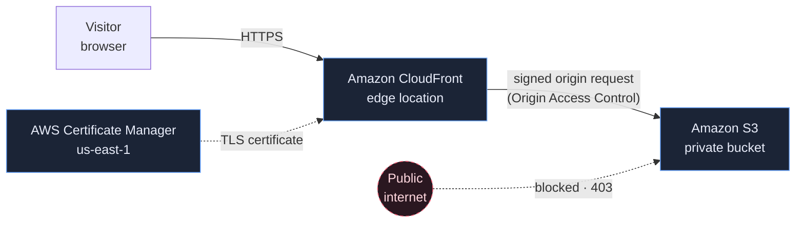

# Cloud Launchpad

A static website deployed on AWS behind a private S3 bucket and CloudFront — the
practical project for a hands-on cloud and platform engineering course.


**Follow the course → [https://s3.aliskool.com/](https://s3.aliskool.com/)**

---

## Why AWS for a static website?

A plain static site — exactly what `main` contains — could be hosted free in minutes
on GitHub Pages, Cloudflare Pages, Netlify or Vercel. This project makes that point on
purpose: the course itself runs on Cloudflare, and `main` is also on GitHub Pages
below.

We could stop there. But then we'd miss the point: AWS infrastructure, IAM, CDNs, TLS,
Terraform and a real CI/CD pipeline. The site stays simple so you can focus on
infrastructure and delivery instead of a backend.

This branch, `main`, is the clean starting point. The finished implementation lives on
[`platform-engineering`](../../tree/platform-engineering).

### See the static site without AWS

This exact site is also published with GitHub Pages:
**[Open the GitHub Pages demo →](https://gcodiac.github.io/aws-s3-static-site-cicd/)**

That's the point — hosting the site is easy. The course uses AWS because the
infrastructure and pipeline are what you're here to learn.

---

## Architecture



The bucket is never public. CloudFront is the only thing allowed to read it, and only
for this one distribution — everything else gets `403 AccessDenied`.

---

## What you'll learn

| Topic | Where it shows up |
| --- | --- |
| Amazon S3 | Private origin bucket |
| Amazon CloudFront | CDN, caching, edge HTTPS |
| AWS Certificate Manager | TLS, issued in `us-east-1` |
| Terraform | The infrastructure above, as reviewable code |
| GitHub Actions | CI checks and an automated deployment |
| GitHub OIDC | Temporary AWS credentials — no stored keys |

---

## Run locally

```bash
git clone git@github.com:gcodiac/aws-s3-static-site-cicd.git
cd aws-s3-static-site-cicd

./scripts/serve.sh    # http://localhost:8080
./scripts/test.sh     # static site checks
```

No build step — `serve.sh` wraps `python3 -m http.server`.

---

## Branches

| Branch | Contents |
| --- | --- |
| `main` | This branch. The static site, and nothing else. |
| [`platform-engineering`](../../tree/platform-engineering) | Terraform + CI/CD, fully implemented, with a readable commit history. |

---

## Course

**[Open the Platform Engineering Course →](https://s3.aliskool.com/)**

Step-by-step lessons — S3, CloudFront, ACM, Terraform, GitHub Actions and OIDC — built
around this exact project.

---

## Cost considerations

| Component | Cost consideration |
| --- | --- |
| GitHub Pages | Free for this demo |
| S3 | Very low for a small static site; storage + requests |
| CloudFront | Usage-based requests/data transfer |
| ACM | No separate charge for public certs used with supported AWS services |
| Route 53 | Optional hosted-zone/domain cost |
| CI/CD | GitHub Actions usage depends on plan/runtime |

For a small training site the AWS cost should be low, but resources should still be
destroyed when no longer needed.

---

## Licence

MIT — see [LICENSE](LICENSE).
