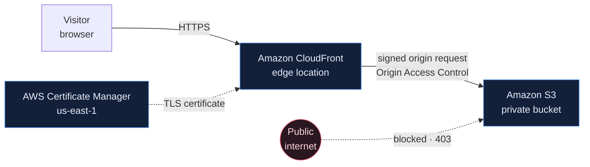
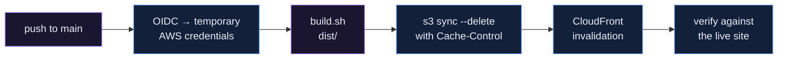

# Cloud Launchpad

Private S3 origin behind CloudFront, provisioned with Terraform, deployed by GitHub
Actions.


> **`platform-engineering`** — completed reference implementation.
> [`main`](../../tree/main) is the plain starting site.

**Follow the course → [https://s3.aliskool.com/](https://s3.aliskool.com/)**

---

## Architecture



The bucket has no website endpoint and no public read policy. CloudFront is the only
principal allowed to read it, and only for this one distribution. Full write-up:
[docs/architecture.md](docs/architecture.md).

---

## Engineering focus

| Area | Implementation |
| --- | --- |
| Storage | Private S3 — encrypted, versioned, no public access |
| CDN | CloudFront with Origin Access Control |
| TLS | ACM, DNS-validated, optional custom domain |
| IaC | Terraform, fully parameterised (no hard-coded domain or account) |
| CI/CD | 3 GitHub Actions workflows |
| Auth | GitHub OIDC → temporary AWS credentials, no stored keys |
| Security | Least-privilege IAM, security response headers, insecure-transport denied |
| Verification | Automated post-deploy checks, including that the bucket is still private |

---

## CI/CD

```
.github/workflows/
├── ci.yml           # pull requests: site checks + Terraform fmt/validate
├── terraform.yml    # Terraform fmt, validate (plan is opt-in on remote state)
└── deploy.yml       # push to main: OIDC → sync to S3 → invalidate → verify
```

`ci.yml` holds no AWS credentials and runs safely on a pull request from a fork.
`deploy.yml` holds `id-token: write` and runs only on `main`.



---

## Infrastructure

```
infra/
├── s3.tf            # private bucket: encryption, versioning, policy
├── cloudfront.tf    # distribution, OAC, response headers
├── acm.tf           # certificate for a custom domain (optional)
├── dns.tf           # Route 53 alias records (optional)
├── iam.tf           # GitHub OIDC provider + scoped deploy role
└── outputs.tf
```

- Private, encrypted, versioned S3 bucket — no website endpoint, no public policy
- CloudFront + Origin Access Control, so the bucket never needs to be public
- ACM certificate and Route 53 records, both optional
- GitHub OIDC provider and a deploy role scoped to this bucket and this distribution

---

## Deploy

```bash
aws sts get-caller-identity     # confirm the account first

cd infra
cp terraform.tfvars.example terraform.tfvars
terraform init
terraform plan
terraform apply
```

From here, `git push origin main` deploys through the GitHub Actions pipeline. To
deploy from a laptop instead: `make deploy invalidate verify`.

---

## Custom domain

Optional — the site works on the default `*.cloudfront.net` domain with no changes.
Certificates for CloudFront must be issued in `us-east-1` regardless of where the
bucket lives. DNS can be Route 53 in the same account or any external provider.

---

## Operations

- [docs/architecture.md](docs/architecture.md) — security model, CI/CD flow, ALB decision
- [docs/runbook.md](docs/runbook.md) — rollback, drift, common failures
- [Course](https://s3.aliskool.com/) — step-by-step lessons built around this project

---

## Tear down

```bash
cd infra
terraform destroy
```

---

## Licence

MIT — see [LICENSE](LICENSE).
