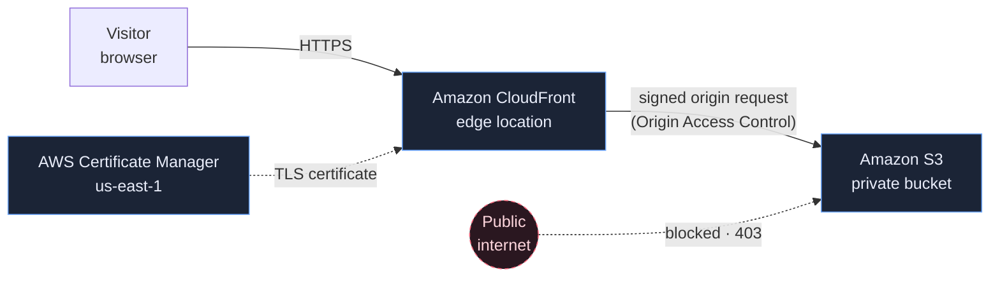

# Cloud Launchpad

A polished static website, and the platform that delivers it: a **private Amazon S3
bucket** behind **Amazon CloudFront**, served over **HTTPS**, with the whole thing
described in **Terraform** and shipped by **GitHub Actions**.


---

## Course

Follow the step-by-step learning platform:

[Open the Platform Engineering Course](https://s3.aliskool.com/)

---

## Why this project exists

If the only goal were to put a static site on the internet, this repository would be
overkill. GitHub Pages, Cloudflare Pages, Netlify and Vercel all host static sites for
free, in about ninety seconds, with a much shorter README.

This project uses AWS on purpose. The website is the excuse; the platform around it is
the point. Building it end to end forces you to work with the pieces that show up in
almost every real cloud system:

| You will build | Because in real work you need to understand |
| --- | --- |
| A private S3 bucket | Object storage, bucket policies, and why "public bucket" is a headline waiting to happen |
| A CloudFront distribution | CDNs, edge caching, cache invalidation, TLS termination |
| An ACM certificate | Certificate issuance, validation, renewal, and why CloudFront insists on `us-east-1` |
| Terraform configuration | Infrastructure as code, state, plan vs apply, drift, teardown |
| GitHub Actions workflows | CI vs CD, pipeline design, deployment gates |
| An IAM role with OIDC trust | Short-lived credentials instead of long-lived access keys |

Every one of those transfers directly to running containers, APIs and data pipelines.
A static site is simply the cheapest, safest place to learn them.

---

## Architecture



The bucket is never public. It has no website endpoint and no public read policy.
CloudFront is the only principal allowed to read from it, and only for this one
distribution. Everything else — direct bucket URLs included — gets `403 AccessDenied`.

---

## Technology

**Site** — HTML, CSS and vanilla JavaScript. No framework, no bundler, no `node_modules`.
What you see in the repository is exactly what the edge serves.

**Infrastructure** — Terraform, Amazon S3, Amazon CloudFront, AWS Certificate Manager,
Origin Access Control, AWS IAM (optionally Amazon Route 53).

**Delivery** — Git, GitHub, GitHub Actions, GitHub OIDC federation to AWS.

---

## Prerequisites

| Tool | Needed for | Check |
| --- | --- | --- |
| Git | Cloning and version control | `git --version` |
| Python 3 | The local preview server | `python3 --version` |
| A GitHub account | Forking the repo and running Actions | — |
| An AWS account | Deploying the infrastructure | — |
| AWS CLI v2 | Talking to AWS from your terminal | `aws --version` |
| Terraform ≥ 1.6 | Provisioning the infrastructure | `terraform version` |

Only Git and Python 3 are required to run the site locally. The AWS tooling becomes
relevant once you start building the platform.

> **Cost note.** The AWS resources in this project sit inside or close to the free tier
> for a small site, but they are not free forever and CloudFront charges for data
> transfer. Tear the infrastructure down when you are finished with it.

---

## Run it locally

```bash
git clone git@github.com:gcodiac/aws-s3-platform-engineering.git
cd aws-s3-platform-engineering

./scripts/serve.sh          # http://localhost:8080
```

`scripts/serve.sh` is a thin wrapper around Python's built-in static file server:

```bash
python3 -m http.server 8080
```

That is the entire toolchain. There is nothing to install and nothing to build, which
is exactly why static hosting is so cheap to operate.

Run the checks the pipeline will eventually run for you:

```bash
./scripts/test.sh
```

---

## Repository layout

```
.
├── index.html              # the homepage
├── 404.html                # custom error page
├── css/styles.css          # all styling, hand-written, no framework
├── js/app.js               # progressive enhancement only
├── assets/                 # icons and images
├── docs/                   # documentation and screenshots
└── scripts/
    ├── serve.sh            # local preview
    └── test.sh             # static site checks
```

---

## Branches

| Branch | What it holds |
| --- | --- |
| `main` | **You are here.** The finished website and nothing else. This is the starting point: no Terraform, no pipeline, no cloud resources. |
| `platform-engineering` | The completed implementation — Terraform infrastructure, GitHub Actions workflows, deployment and verification scripts. |

`main` is deliberately incomplete. Building the missing half is the work.

If you want to see where it ends up — or compare your solution against a finished one —
read the other branch, and read its history rather than just its files:

```bash
git switch platform-engineering
git log --oneline
```

The commits are ordered the way the platform was built: bucket, then distribution, then
the lock-down, then certificates, then the pipeline. Each one is small enough to read in
a single sitting.

---

## Licence

MIT — see [LICENSE](LICENSE).
