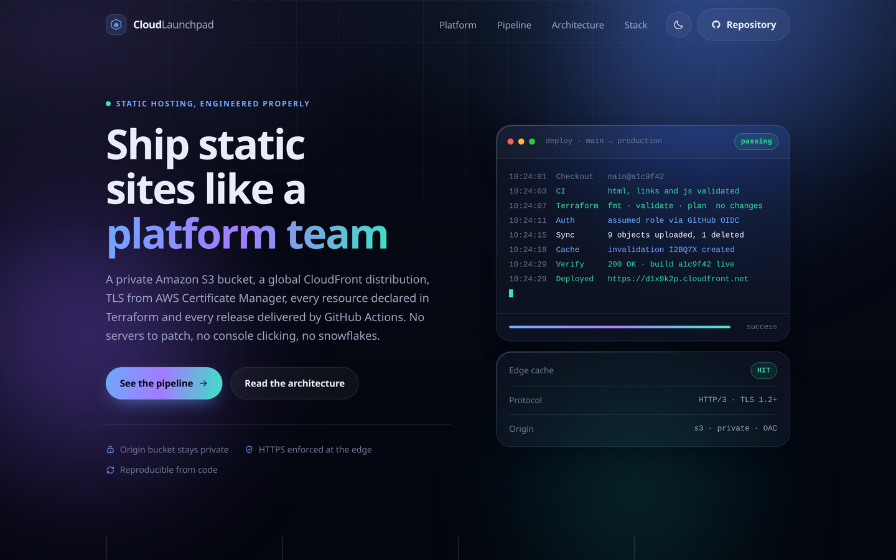
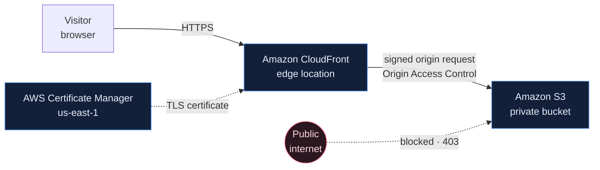
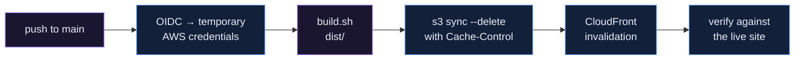

# Cloud Launchpad

A polished static website, and the platform that delivers it: a **private Amazon S3
bucket** behind **Amazon CloudFront**, served over **HTTPS**, with the whole thing
described in **Terraform** and shipped by **GitHub Actions**.



> **This is the `platform-engineering` branch** — the completed implementation.
> [`main`](../../tree/main) holds the website alone and is the starting point.

---

## Course

Follow the step-by-step learning platform:

[Open the Platform Engineering Course](https://s3-devops.aliskool.com/)

---

## What is here

| | |
| --- | --- |
| **Website** | Hand-written HTML, CSS and vanilla JavaScript. No framework, no bundler, no `node_modules`. |
| **Infrastructure** | 13 Terraform resources: S3, CloudFront, OAC, bucket policy, ACM, IAM/OIDC. |
| **Pipeline** | Three GitHub Actions workflows: CI, Terraform checks, and a deployment that verifies itself. |
| **Credentials** | None. GitHub federates into AWS over OIDC and gets credentials that expire with the job. |

---

## Architecture



The bucket has no website endpoint and no public read policy. CloudFront is the only
principal allowed to read it, and only for this one distribution — everything else,
including a direct bucket URL, gets `403 AccessDenied`.

**[docs/architecture.md](docs/architecture.md)** covers the security path, the CI/CD
pipeline, the OIDC token exchange, the Terraform workflow, and where an ALB would go
if this ever grew a backend.

---

## Terraform

```
infra/
├── versions.tf              # Terraform >= 1.6, AWS provider ~> 6.0
├── providers.tf             # default provider + us_east_1 alias for ACM
├── variables.tf             # every input, validated and documented
├── locals.tf                # data sources and computed names
├── s3.tf                    # bucket, public access block, encryption,
│                            #   versioning, lifecycle, bucket policy
├── cloudfront.tf            # OAC, response headers policy, distribution
├── acm.tf                   # certificate + DNS validation (optional)
├── dns.tf                   # Route 53 alias records (optional)
├── iam.tf                   # GitHub OIDC provider and deployment role
├── outputs.tf               # what the pipeline and the runbook need
├── backend.tf.example       # remote state, when local state stops being enough
└── terraform.tfvars.example
```

Resources created:

| Resource | Purpose |
| --- | --- |
| `aws_s3_bucket` | The origin. Private, encrypted, versioned. |
| `aws_s3_bucket_public_access_block` | All four switches on. Overrides any policy that would make it public. |
| `aws_s3_bucket_ownership_controls` | `BucketOwnerEnforced` — ACLs disabled entirely. |
| `aws_s3_bucket_server_side_encryption_configuration` | SSE-S3 with a bucket key. |
| `aws_s3_bucket_versioning` + `aws_s3_bucket_lifecycle_configuration` | Rollback, with old versions expiring after 30 days. |
| `aws_s3_bucket_policy` | Grants `s3:GetObject` to CloudFront for this distribution only; denies plain HTTP. |
| `aws_cloudfront_origin_access_control` | SigV4 signing of every origin request. |
| `aws_cloudfront_response_headers_policy` | HSTS, CSP, nosniff, frame-options, permissions-policy. |
| `aws_cloudfront_distribution` | The CDN: TLS, caching, compression, custom error pages. |
| `aws_acm_certificate` (+ validation) | TLS for a custom domain. Optional. |
| `aws_route53_record` | DNS alias records. Optional. |
| `aws_iam_openid_connect_provider` | Trusts GitHub's token issuer. |
| `aws_iam_role` + `aws_iam_role_policy` | What the pipeline may do: sync this bucket, invalidate this distribution. Nothing else. |

Custom domains are entirely optional and nothing is hard-coded — see
[Custom domain](#custom-domain) below.

---

## CI/CD

```
.github/workflows/
├── ci.yml           # pull requests: site checks, build, artifact upload
├── terraform.yml    # pull requests touching infra/: fmt, validate, optional plan
└── deploy.yml       # push to main: OIDC → build → sync → invalidate → verify
```

They are separate files because they need different permissions. `ci.yml` holds no
credentials and can safely run on a pull request from a fork. `deploy.yml` holds
`id-token: write` and runs only on `main`.

The deployment ends by fetching the live site and asserting that
`/assets/build-info.json` reports the commit that triggered the run. A pipeline that
goes green because `aws s3 sync` exited zero has proved the upload worked, not that
the site is up.



---

## Deploy it yourself

### 1. Infrastructure

```bash
aws sts get-caller-identity     # confirm the account before you change it

cd infra
cp terraform.tfvars.example terraform.tfvars
terraform init
terraform plan
terraform apply
```

### 2. Pipeline

```bash
terraform output deployment_configuration
```

Set those five values as repository **variables** (Settings → Secrets and variables →
Actions → Variables). They are identifiers, not credentials — a role ARN is useless
without an OIDC token from the repository named in its trust policy.

Set `github_repository` in `terraform.tfvars` to your own fork and re-apply, otherwise
the role's trust policy will not recognise your workflow.

### 3. Ship

```bash
git push origin main
```

Or from a laptop, without the pipeline:

```bash
make deploy invalidate verify
```

---

## Custom domain

Nothing about the domain is hard-coded. The site runs perfectly on the free
`*.cloudfront.net` name, and a custom domain is opt-in.

**DNS in Route 53, same account** — one apply:

```hcl
domain_name          = "launchpad.example.com"
route53_zone_id      = "Z0123456789ABCDEFGHIJ"
attach_custom_domain = true
```

**DNS anywhere else** (Cloudflare, the registrar, a corporate zone) — two applies:

```bash
# 1. Request the certificate
#    terraform.tfvars: domain_name = "launchpad.example.com"
terraform apply
terraform output acm_validation_records   # create these at your DNS provider

# 2. Once the certificate is ISSUED
#    terraform.tfvars: attach_custom_domain = true
terraform apply
terraform output dns_target               # point your domain here
```

Certificates for CloudFront **must** be issued in `us-east-1` regardless of where the
bucket lives — that is what the `aws.us_east_1` provider alias in `providers.tf` is
for. A certificate in the wrong region is valid and completely invisible to
CloudFront, which is the most common reason a custom domain "does not work".

Those validation records must stay in place after issuance. ACM re-checks them at
renewal, so deleting them produces an expired certificate months later, with no
warning.

---

## Local development

```bash
./scripts/serve.sh    # http://localhost:8080
./scripts/test.sh     # the checks CI runs
./scripts/build.sh    # produce dist/
```

Only Git and Python 3 are needed to run and test the site. Terraform and the AWS CLI
become relevant when you deploy.

| Script | Does |
| --- | --- |
| `scripts/serve.sh` | Serves the repository root over HTTP |
| `scripts/test.sh` | Files, HTML structure, link resolution, JS syntax, secrets, build, HTTP smoke test |
| `scripts/build.sh` | Assembles `dist/` from an explicit file list and stamps the build |
| `scripts/deploy.sh` | Two-pass `s3 sync --delete` with per-tier Cache-Control |
| `scripts/invalidate.sh` | Creates a CloudFront invalidation, optionally waits |
| `scripts/verify-deployment.sh` | Twelve assertions against the live site |

`make help` lists the equivalent targets.

---

## Operations

[**docs/runbook.md**](docs/runbook.md) covers rolling back a bad deployment, restoring
previous object versions, checking for drift, and a table of the failures you are
most likely to hit with their causes.

---

## Tear it down

```bash
cd infra
terraform destroy
```

Everything in this project is disposable by design, and rebuilding it takes one
command. Nothing here runs continuously, but CloudFront bills for data transfer and S3
bills for storage, so destroy the stack when you are finished with it.

`force_destroy_bucket = true` is needed for `destroy` to delete a bucket that still
contains the site. Without it, `destroy` fails safely — which is the right default for
anything holding data you would miss.

---

## Licence

MIT — see [LICENSE](LICENSE).
